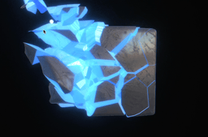

# Tear Apart

Preview: [proto.lucidity.design/sites/tear-apart](https://proto.lucidity.design/sites/tear-apart)

Recreated interactive prototype of the Tear Apart experience, preserved as a local static clone with scripts for refresh, verification, and preview.




Local clone of the deployed site at [tearapart.activetheory.dev](https://tearapart.activetheory.dev/).

## Setup

```bash
npm install
npm run clone
npm run build
npm run dev
```

This project is a local clone pipeline for the deployed site:

- `npm install` installs the small local toolchain.
- `npm run clone` refreshes `public/` from the live deployment.
- `npm run build` copies the current clone into `dist/`.
- `npm run dev` serves `public/` locally.

## Commands

- `npm run clone` captures the live page's runtime requests from `https://tearapart.activetheory.dev/`, downloads the required same-origin files into `public/`, and validates the result locally.
- `npm run build` copies the cloned runtime into `dist/` for static hosting or handoff.
- `npm run dev` serves the cloned site from `public/` on `http://127.0.0.1:4173`.
- `PORT=4180 npm run dev` starts the cloned site on a different local port when `4173` is already in use.
- `npm run preview` serves `dist/` on `http://127.0.0.1:4174`.
- `npm run verify` replays the local `public/` runtime in Playwright and reports missing same-origin files.

## Git

This folder is a standalone Git repository rooted at:

```bash
/Users/richard/Local Sites/Codex Workspace/repos/prototypes/tear-apart
```

That means this project has its own local `.git/` directory and can be committed independently.

Typical flow:

```bash
git status
git add .
git commit -m "Update tear-apart clone"
```

If you only want to refresh the local clone and rebuild the static output before committing:

```bash
npm run clone
npm run build
git status
```

## Layout

- `public/` is the cloned deployed runtime.
- `dist/` is the build output for static serving.
- `scripts/` contains the clone, serve, and validation utilities.

Cloned from [tearapart.activetheory.dev](https://tearapart.activetheory.dev/).
